# Personal AI Voice Assistant 🎙️

> A production-ready AI voice assistant featuring **Sanket Devmunde's** professional persona, powered by Pipecat, Deepgram, OpenAI GPT-4, and Cartesia with real-time WebRTC communication.

[](https://render.com)
[](https://vercel.com)
[](https://pipecat.ai)

## ✨ Features

- 🎯 **AI Persona** - Answers questions about Sanket Devmunde's professional experience, skills, and projects
- ⚡ **Real-time Voice** - \<1 second latency with WebRTC audio streaming
- 🧠 **Smart Context** - Maintains conversation history across multiple turns
- 🎨 **Beautiful UI** - Modern dark-themed interface with streaming transcriptions
- 🌐 **Production Deployment** - Live on Render (backend) and Vercel (frontend)
- 🔒 **Secure Authentication** - Supabase Auth with email/password, protected routes, and persistent sessions
- 👤 **User Profiles** - Personalized dashboard and greeting messages
- 🚀 **Auto-Greeting** - Bot introduces itself by name when you connect
- 💫 **Interactive UI** - Animated greetings, user menu, and dynamic text streaming

## 🏗️ System Architecture

### High-Level Architecture


### Data Flow Pipeline


### WebRTC Connection Sequence

```mermaid
sequenceDiagram
    participant F as Frontend
    participant B as Backend
    participant P as Pipecat Pipeline

    F->>B: 1. POST /offer (WebRTC SDP)
    B->>B: 2. Create Answer + Connection
    B->>P: 3. Initialize Voice Pipeline
    B->>F: 4. Return Answer (pc_id)
    F->>B: 5. POST /candidate (ICE)
    B->>B: 6. Add ICE Candidates
    B-->>F: 7. Connection Established ✓
    F->>B: 8. Audio Stream Active
    P->>F: 9. Bot Greeting Message
    F->>B: 10. User speaks
    B->>F: 11. Bot responds

    Note over F,B: Low-latency <1s response time
```



## 📋 Tech Stack

### Backend

| Component | Technology               | Version     | Purpose                      |
| --------- | ------------------------ | ----------- | ---------------------------- |
| Framework | **FastAPI**              | Latest      | WebRTC signaling server      |
| Voice AI  | **Pipecat**              | 0.0.96      | Voice pipeline orchestration |
| STT       | **Deepgram**             | Nova-3      | Real-time speech-to-text     |
| LLM       | **OpenAI**               | GPT-4o-mini | Conversational AI            |
| TTS       | **Cartesia**             | Sonic       | Natural voice synthesis      |
| WebRTC    | **aiortc + SmallWebRTC** | 1.14.0+     | Peer-to-peer audio transport |
| VAD       | **Silero**               | Latest      | Voice activity detection     |
| Logging   | **Loguru**               | 0.7.3       | Structured logging           |
| Auth      | **Supabase**             | Latest      | Authentication & Database    |
| Security  | **JWT**                  | Latest      | Token-based auth             |

### Frontend

| Component     | Technology        | Version  | Purpose                    |
| ------------- | ----------------- | -------- | -------------------------- |
| Framework     | **React**         | 19.2.0   | UI library                 |
| Language      | **TypeScript**    | 5.9.3    | Type safety                |
| Build Tool    | **Vite**          | 7.2.4    | Fast dev server & bundling |
| Styling       | **Tailwind CSS**  | 4.1.17   | Utility-first CSS          |
| UI Components | **shadcn/ui**     | Latest   | Pre-built components       |
| Animations    | **Framer Motion** | 12.23.24 | Smooth animations          |
| Icons         | **Lucide React**  | Latest   | Icon library               |
| Routing       | **React Router**  | 7.9.6    | Client-side routing        |
| Notifications | **Sonner**        | 2.0.7    | Toast notifications        |
| Auth          | **Supabase**      | Latest   | Authentication client      |
| State Mgmt    | **Zustand**       | Latest   | Global auth state          |
| Theme         | **next-themes**   | 0.4.6    | Dark/light mode            |

### Deployment

- **Backend**: [Render](https://render.com) (Python web service)
- **Frontend**: [Vercel](https://vercel.com) (Static site hosting)
- **TURN Server**: [Metered.ca](https://metered.ca) (WebRTC NAT traversal)

## 🚀 Quick Start

### Prerequisites

1. **Python 3.12+** with [uv](https://docs.astral.sh/uv/) package manager

   ```bash
   # Install uv
   curl -LsSf https://astral.sh/uv/install.sh | sh
   ```

2. **Node.js 18+** and npm

   ```bash
   node --version  # Should be 18.0.0 or higher
   ```

3. **API Keys** (all offer free tiers):
   - **Deepgram** → [console.deepgram.com](https://console.deepgram.com) ($200 free credit)
   - **OpenAI** → [platform.openai.com/api-keys](https://platform.openai.com/api-keys)
   - **Cartesia** → [cartesia.ai](https://cartesia.ai) (free tier available)
   - **Metered TURN** → [metered.ca](https://metered.ca) (free tier for WebRTC)
   - **Supabase** → [supabase.com](https://supabase.com) (free tier for Auth/DB)

### Installation

#### 1. Clone Repository

```bash
git clone https://github.com/YOUR_USERNAME/personal-voice-bot.git
cd personal-voice-bot
```

#### 2. Backend Setup

```bash
cd backend

# Install dependencies
uv sync

# Configure environment variables
cp .env.example .env

# Edit .env with your API keys:
# DEEPGRAM_API_KEY=your_key_here
# OPENAI_API_KEY=sk-...
# CARTESIA_API_KEY=your_key_here
# SUPABASE_URL=https://your-project.supabase.co
# SUPABASE_SERVICE_KEY=your_service_role_key
# ICE_SERVERS=[{"urls":"stun:..."},{"urls":"turn:...","username":"...","credential":"..."}]
```

**TURN Server Configuration** (ICE_SERVERS format):

```json
[
  { "urls": "stun:stun.relay.metered.ca:80" },
  {
    "urls": "turn:global.relay.metered.ca:80",
    "username": "YOUR_USERNAME",
    "credential": "YOUR_PASSWORD"
  },
  {
    "urls": "turn:global.relay.metered.ca:80?transport=tcp",
    "username": "YOUR_USERNAME",
    "credential": "YOUR_PASSWORD"
  },
  {
    "urls": "turn:global.relay.metered.ca:443",
    "username": "YOUR_USERNAME",
    "credential": "YOUR_PASSWORD"
  },
  {
    "urls": "turns:global.relay.metered.ca:443?transport=tcp",
    "username": "YOUR_USERNAME",
    "credential": "YOUR_PASSWORD"
  }
]
```

**Start backend server:**

```bash
uv run uvicorn server:app --host 0.0.0.0 --port 7860
```

Server runs at: **http://localhost:7860**

#### 3. Frontend Setup

```bash
cd frontend

# Install dependencies
npm install

# (Optional) Create .env for custom API URL
# echo "VITE_API_URL=http://localhost:7860" > .env
# echo "VITE_SUPABASE_URL=https://your-project.supabase.co" >> .env
# echo "VITE_SUPABASE_ANON_KEY=your_anon_key" >> .env

# Start development server
npm run dev
```

Frontend runs at: **http://localhost:5173**

### First Conversation

### First Conversation

1. Open **http://localhost:5173** in Chrome or Firefox
2. **Sign Up** or **Login** to your account
3. Click **"Start Conversation"** button
4. Allow microphone access when prompted
5. Wait for the personalized greeting: _"Hey [Your Name]!..."_
6. Start asking questions about Sanket Devmunde's work!

**Example Questions:**

- "What are you currently working on?"
- "Tell me about your experience with AI systems"
- "What's your superpower?"
- "What projects have you built?"

## 🧪 Testing

### Local Testing Checklist

Run through these verification steps:

```bash
# Terminal 1: Start backend
cd backend && uv run uvicorn server:app --host 0.0.0.0 --port 7860

# Terminal 2: Start frontend
cd frontend && npm run dev

# Browser: http://localhost:5173
```

**Verification Steps:**

- [ ] ✅ Frontend loads without errors
- [ ] ✅ "Start Conversation" button appears
- [ ] ✅ Click button → microphone permission requested
- [ ] ✅ WebRTC connection established (check console for "Connected to AI Persona")
- [ ] ✅ Bot greets you within 3 seconds
- [ ] ✅ Your speech appears as text (user transcription)
- [ ] ✅ Bot responds contextually (check assistant message)
- [ ] ✅ You hear the bot's voice clearly
- [ ] ✅ Multi-turn conversation works (ask follow-up questions)
- [ ] ✅ Response latency is \<2 seconds

### Testing Backend Endpoints

#### Health Check

```bash
curl http://localhost:7860/

# Expected response:
# {"transport":"webrtc","url":"http://localhost:7860","ice_servers":[...]}
```

#### WebRTC Offer/Answer

```bash
# This is normally done by the frontend, but you can test manually:
curl -X POST http://localhost:7860/offer \
  -H "Content-Type: application/json" \
  -d '{"sdp":"v=0...","type":"offer"}'

# Expected: JSON with answer SDP and pc_id
```

### Debugging

**Check Backend Logs:**

```bash
# Look for success patterns:
✅ "Created connection with pc_id: SmallWebRTCConnection#0"
✅ "ICE connection state is connected"
✅ "Client connected"
✅ "Connecting to Deepgram"
✅ "Connecting to Cartesia TTS"

# Error patterns:
❌ "Skipping candidate without sdpMid" → Frontend ICE issue
❌ "Timeout establishing connection" → TURN server config problem
❌ "Failed to parse ICE_SERVERS" → JSON format error in .env
```

**Check Frontend Console:**

```javascript
// Success indicators:
✅ "Data channel open"
✅ "Connected to AI Persona"

// Error indicators:
❌ "Failed to connect" → Backend not running
❌ "NotAllowedError" → Microphone permission denied
```

## 🎭 Customization

### Change the AI Persona

Edit `backend/bot.py` (line 66-130) to customize the system prompt:

```python
messages = [
    {
        "role": "system",
        "content": """You are [YOUR NAME], a [YOUR ROLE].

        About You:
        [Your background, education, current work]

        Skills:
        [Your technical expertise]

        Tone:
        - Be [conversational/formal/friendly]
        - Keep answers [concise/detailed]
        """
    }
]
```

### Change Voice

In `backend/bot.py` (line 59-62), modify the Cartesia voice:

```python
tts = CartesiaTTSService(
    api_key=os.getenv("CARTESIA_API_KEY"),
    voice_id="YOUR_VOICE_ID",  # See https://docs.cartesia.ai/voices
)
```

**Available Voices:**

- `bdab08ad-4137-4548-b9db-6142854c7525` - Default (Sonic, conversational)
- Check [Cartesia Voices](https://docs.cartesia.ai/api-reference/voices) for more options

### Customize UI Theme

Edit `frontend/src/App.tsx` or `frontend/tailwind.config.js` for colors and styles.

## 📂 Project Structure

```
personal-voice-bot/
├── backend/
│   ├── bot.py                  # Pipecat voice pipeline & AI persona
│   ├── server.py               # FastAPI WebRTC signaling server & Auth endpoints
│   ├── auth.py                 # Supabase authentication logic
│   ├── pyproject.toml          # Python dependencies (uv)
│   ├── .env.example            # Environment variable template
│   ├── Dockerfile              # Container configuration
│   └── render.yaml             # Render deployment config
│
├── frontend/
│   ├── src/
│   │   ├── App.tsx             # Main React app with Routing & WebRTC
│   │   ├── components/
│   │   │   ├── auth/           # Login, Signup, ProtectedRoute
│   │   │   ├── ui/             # shadcn/ui + UserMenu, AnimatedGreeting
│   │   │   └── magicui/        # Animated components
│   │   ├── lib/                # Supabase client & utils
│   │   ├── store/              # Zustand Auth Store
│   │   └── index.css           # Global Tailwind styles
│   ├── package.json            # Node dependencies
│   ├── vite.config.ts          # Vite bundler config
│   ├── tailwind.config.js      # Tailwind CSS config
│   └── vercel.json             # Vercel deployment config
│
├── DEPLOYMENT.md               # Step-by-step deployment guide
└── README.md                   # This file
```

## 🚢 Deployment

See **[DEPLOYMENT.md](./DEPLOYMENT.md)** for complete production deployment instructions.

### Quick Deploy Summary

**Backend (Render):**

1. Connect GitHub repo
2. Set root directory to `backend`
3. Add environment variables (API keys + ICE_SERVERS)
4. Deploy

**Frontend (Vercel):**

1. Connect GitHub repo
2. Set root directory to `frontend`
3. Set `VITE_API_URL` to your Render backend URL
4. Deploy

## 🔧 Environment Variables

### Backend (.env)

| Variable               | Required       | Description               | Example                 |
| ---------------------- | -------------- | ------------------------- | ----------------------- |
| `DEEPGRAM_API_KEY`     | ✅ Yes         | Deepgram STT API key      | `a1b2c3d4e5f6...`       |
| `OPENAI_API_KEY`       | ✅ Yes         | OpenAI GPT API key        | `sk-proj-...`           |
| `CARTESIA_API_KEY`     | ✅ Yes         | Cartesia TTS API key      | `cart_...`              |
| `SUPABASE_URL`         | ✅ Yes         | Supabase Project URL      | `https://...`           |
| `SUPABASE_SERVICE_KEY` | ✅ Yes         | Supabase Service Role Key | `eyJ...`                |
| `ICE_SERVERS`          | ⚠️ Recommended | TURN/STUN servers (JSON)  | `[{"urls":"stun:..."}]` |
| `PORT`                 | ⚙️ Optional    | Server port               | `7860` (default)        |
| `HOST`                 | ⚙️ Optional    | Server host               | `0.0.0.0` (default)     |

### Frontend (.env)

| Variable                 | Required    | Description          | Example                                         |
| ------------------------ | ----------- | -------------------- | ----------------------------------------------- |
| `VITE_API_URL`           | ⚙️ Optional | Backend URL          | `http://localhost:7860` (default for local dev) |
| `VITE_SUPABASE_URL`      | ✅ Yes      | Supabase Project URL | `https://...`                                   |
| `VITE_SUPABASE_ANON_KEY` | ✅ Yes      | Supabase Anon Key    | `eyJ...`                                        |

## 🛠️ Troubleshooting

### Common Issues & Solutions

| Issue                                 | Possible Cause             | Solution                                                 |
| ------------------------------------- | -------------------------- | -------------------------------------------------------- |
| **"Failed to connect"**               | Backend not running        | Start backend: `cd backend && uv run uvicorn server:app` |
| **"Timeout establishing connection"** | TURN server not configured | Add valid `ICE_SERVERS` to backend `.env`                |
| **No bot greeting**                   | OpenAI API key invalid     | Check `OPENAI_API_KEY` in `.env`                         |
| **Microphone not working**            | Permission denied          | Allow mic access in browser settings                     |
| **Transcription not showing**         | Deepgram issue             | Verify `DEEPGRAM_API_KEY` is active                      |
| **Robotic/no voice**                  | Cartesia TTS issue         | Check `CARTESIA_API_KEY` credentials                     |
| **WebRTC candidates skipped**         | Frontend field mismatch    | Ensure frontend sends `sdp_mid` and `sdp_mline_index`    |

### WebRTC Debugging

**If connection times out:**

1. **Check TURN server allocation:**

   ```bash
   # Backend logs should show:
   ✅ "TURN allocation created ('IP', PORT) (expires in 600 seconds)"
   ```

2. **Verify ICE candidates are accepted:**

   ```bash
   # Backend logs should show:
   ✅ "Received candidate for pc_id: SmallWebRTCConnection#0"
   ❌ NOT "Skipping candidate without sdpMid or sdpMLineIndex"
   ```

3. **Network troubleshooting:**
   - Disable VPN temporarily
   - Check firewall allows UDP traffic
   - Try different browser (Chrome/Firefox work best)
   - Use `http://localhost` not `127.0.0.1`

## 📚 API Reference

### Backend Endpoints

#### `GET /`

Returns WebRTC connection configuration.

**Response:**

```json
{
  "transport": "webrtc",
  "url": "http://localhost:7860",
  "ice_servers": [{ "urls": "stun:stun.l.google.com:19302" }]
}
```

#### `POST /offer`

Handles WebRTC offer from client.

**Request Body:**

```json
{
  "sdp": "v=0\r\no=- 123456789 2 IN IP4 127.0.0.1\r\n...",
  "type": "offer"
}
```

**Response:**

```json
{
  "sdp": "v=0\r\no=- 987654321 2 IN IP4 0.0.0.0\r\n...",
  "type": "answer",
  "pc_id": "SmallWebRTCConnection#0"
}
```

#### `POST /candidate`

Adds ICE candidate to peer connection.

**Request Body:**

```json
{
  "pc_id": "SmallWebRTCConnection#0",
  "candidates": [
    {
      "candidate": "candidate:1 1 UDP 2130706431 192.168.1.100 54321 typ host",
      "sdp_mid": "0",
      "sdp_mline_index": 0
    }
  ]
}
```

**Response:**

```json
{
  "status": "ok"
}
```

## 🤝 Contributing

Contributions are welcome! Please:

1. Fork the repository
2. Create a feature branch: `git checkout -b feature/amazing-feature`
3. Make your changes
4. Test locally (backend + frontend)
5. Commit: `git commit -m 'Add amazing feature'`
6. Push: `git push origin feature/amazing-feature`
7. Open a Pull Request

## 📄 License

MIT License - Free for personal and commercial use.

## 🙏 Acknowledgments

This project is built with amazing open-source technologies:

- **[Pipecat](https://pipecat.ai/)** - Voice AI framework by Daily.co
- **[Deepgram](https://deepgram.com/)** - Industry-leading STT
- **[OpenAI](https://openai.com/)** - GPT-4 language models
- **[Cartesia](https://cartesia.ai/)** - Ultra-low latency TTS
- **[shadcn/ui](https://ui.shadcn.com/)** - Beautifully designed components
- **[MagicUI](https://magicui.design/)** - Animated React components
- **[Tailwind CSS](https://tailwindcss.com/)** - Utility-first CSS framework
- **[Vite](https://vitejs.dev/)** - Next-generation frontend tooling

Special thanks to the open-source community! 💙

---

_Production-ready AI voice assistant with <1s latency_ ⚡


